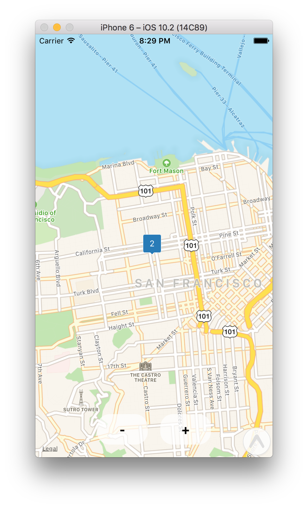

# React Native Maps Marker Cluster example

# 

This project is an example to show how to build a cluster of marker with [react-native-maps](https://github.com/airbnb/react-native-maps). 

The idea comes from a [PR from react-native-maps repo](https://github.com/airbnb/react-native-maps/pull/137).

This project was bootstrapped with [Create React Native App](https://github.com/react-community/create-react-native-app).